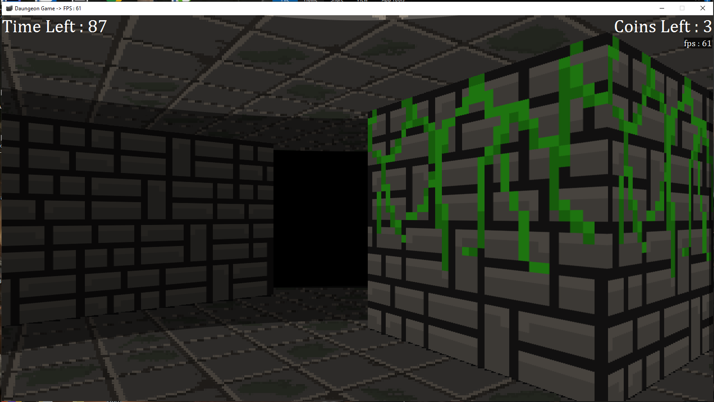
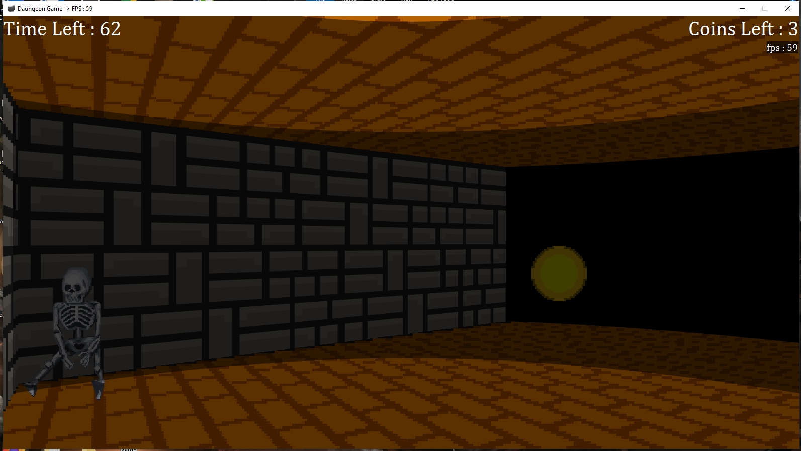
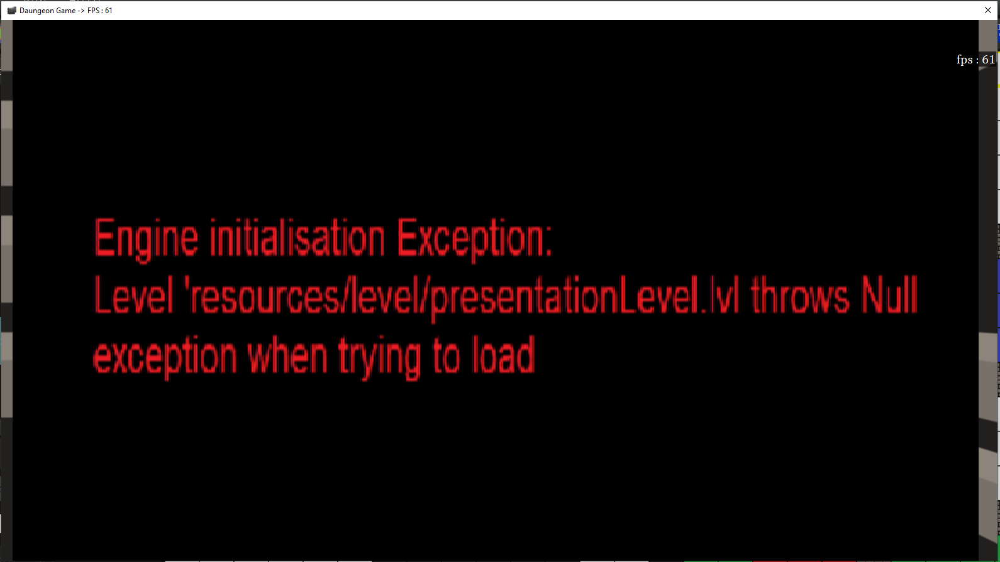
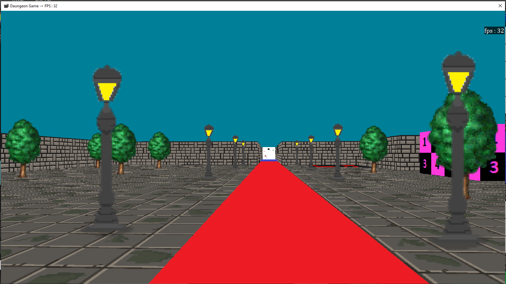
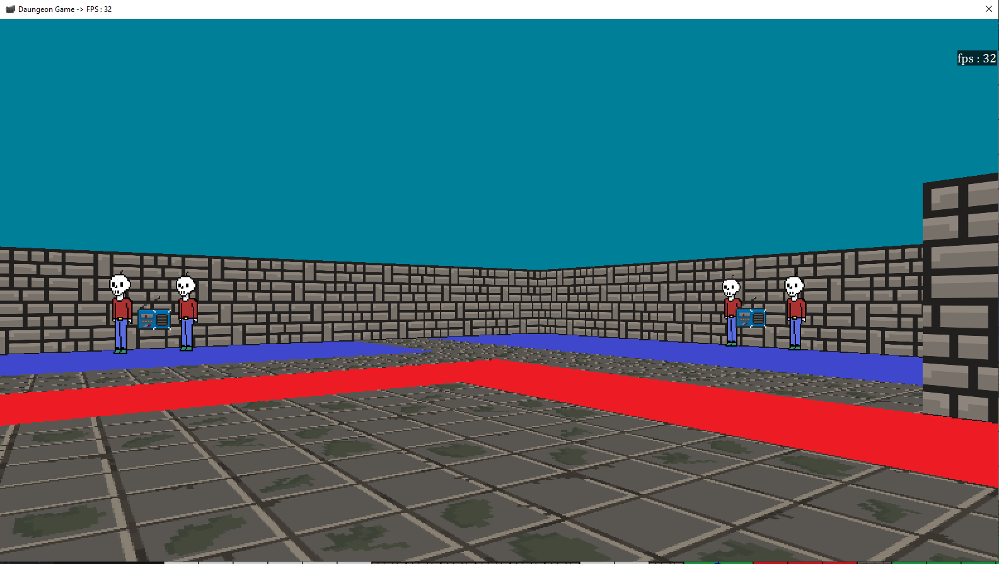

The Optik engine is a ray-casting game engine consisting of two main components: the renderer and the editor. The renderer handles the rendering of game entities, while the editor enables users to create new game entities, define game maps, and make modifications as needed.

This project was undertaken by a group of four individuals as part of our program development course. Although the project exceeded the requirements of the course, we made the decision to pursue this ambitious endeavor, primarily because one of our group members is a very skilled programmer and had already devised a comprehensive plan for the project. Given the division of tasks, we formed two subgroups, each dedicated to one part of the project.

My partner and I took on the responsibility of developing the editor. While this portion may not have been as technically challenging as the renderer, it presented a significant learning opportunity for us. Undertaking a project of this scale was a novel experience, requiring extensive self-study beyond what was covered in the classroom. Here is a screenshot showcasing the editor: 

Following discussions, we allocated tasks, with my partner focusing on the front-end development, and I took charge of the back-end implementation. One major challenge I encountered was working with JSON files. We needed a method to save the current state of our work, including all created entities and maps. At that time, I had limited knowledge of JSON. However, through dedicated learning, I quickly grasped its fundamentals. Although our JSON file structure became quite intricate due to the inclusion of entities and nested signal objects, I managed to handle it effectively.

Apart from saving the data, we also needed a way to read from JSON files. By the time I implemented the load function, I had gained significant proficiency in working with JSON. Although a few challenges remained, they were relatively minor in nature.

Overall, this project served as a remarkable learning experience for all of us. Personally, it marked my first endeavor in programming a substantial and meaningful project, collaborating with highly talented individuals to bring our project to life.

Credits to my teammates:
- Abderrahman Laoufi (Map & entity editor)  
  email: laoufiabder@gmail.com  <a href="https://github.com/Eerohne">github</a>
- Merouane Issad (Render)   email: merouaneissad@gmail.com
- Jeffrey Gan (Render)

Here are some pictures of the complete project:

